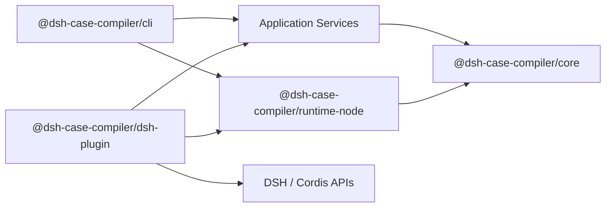

# DSH Case Compiler

> 将一次冗长的 Agent 失败 Session，编译为安全、可重放、可审计的最小回归 Case。

[](https://github.com/changsheng1224/dsh/actions/workflows/ci.yml)
[](https://www.typescriptlang.org/)
[](https://github.com/changsheng1224/dsh/blob/main/LICENSE)

## 项目背景与目标

复杂 Agent 的一次失败通常不是单条报错，而是一段同时包含多轮对话、动态 Context、Tool Schema、Tool Call、Tool Result 与外部状态的长轨迹。研发人员若直接复跑完整 Session，不仅很难判断究竟哪些信息维持了失败，还会受到模型随机性、环境漂移和写 Tool 副作用的干扰，导致 Bad Case 难定位、难共享，也难作为稳定的修复回归资产。

DSH Case Compiler 面向 [DeepSeek Harness（DSH）](https://github.com/deepseek-ai/DeepSeek-Harness) 的失败调试场景，目标是把“偶发且冗长的失败记录”转化为“边界明确、证据充分、可重复验证的最小 Case”。系统从历史 Session 重建实际请求面，以 Failure Oracle 定义需要保留的失败行为，通过受控重复回放和分层 Delta Debugging 删除无关输入，最终输出可移植的 Case Bundle，支撑问题归因、团队共享和修复前后同配置验证。

它不是日志截断器，也不会因为原始 Transcript 中出现过错误就认定缩减有效。只有具备完整历史证据且通过重复行为验证的 Case 才能进入最小化；证据不足时系统明确降级为 `transcript-only`，不产生行为最小化结论。

整体处理链路如下：


最终结果被称为 **Observed 1-minimal Case**：在固定模型、配置、环境、缩减粒度和经验阈值下，任一剩余可缩减单元都无法继续删除。该结论用于证明“这个 Case 已足够小且仍能稳定暴露问题”，而不是声称得到全局最小输入或直接找到因果根因。

## 核心能力

| 能力             | 作用                                                                                                   |
| ---------------- | ------------------------------------------------------------------------------------------------------ |
| Session 编译     | 从 JSONL 或 DSH Session ID 重建版本化 CaseIR，统一表达请求、History、Context、Tool 交换及来源信息      |
| 完整性与证据门禁 | 检查历史 Prompt、Context、Tool Schema 与 Result 是否闭合；缺失关键证据时只允许静态分析                 |
| Failure Oracle   | 将重复 Tool Call、错误 Tool 选择、禁止 Tool 等失败现象转换为可执行、可重复判定的行为条件               |
| 分层 DDMin       | 按 History、Context、Tool Surface 与 Workspace Files 由粗到细缩减，并维护依赖闭包与不可缩减边界        |
| 安全重放         | 以 Tool Policy、Fixture Runtime 和预算控制隔离真实副作用，未知 Tool、Fixture Miss 与执行异常均失败关闭 |
| 修复验证         | 对原始版本、Minimal Case 与修复版本执行同 Oracle、同配置复跑，区分“偶然未出现”与“问题已关闭”           |
| Case 资产化      | 输出带 Schema Version、校验和、脱敏结果及 Markdown/JSON/JUnit 报告的 Case Bundle，便于审查与共享       |

## 五分钟离线体验

### 环境要求

- Node.js `^22.19.0 || >=24.0.0`
- pnpm `11.19.0`
- Git `>=2.26`

### 安装与验证

```bash
git clone https://github.com/changsheng1224/dsh.git
cd dsh
corepack enable
pnpm install --frozen-lockfile
pnpm build
pnpm test:e2e
```

离线 E2E 包含两类可重复 Demo：

- [`synthetic-search-loop`](https://github.com/changsheng1224/dsh/tree/main/examples/synthetic-search-loop)：重复调用同一搜索 Tool；
- [`realistic-wrong-tool`](https://github.com/changsheng1224/dsh/tree/main/examples/realistic-wrong-tool)：选择具有外部写语义的错误 Tool。

它们覆盖 Session 导入、CaseIR、Oracle、最小化、Fixture 回放、Bundle 往返校验和修复后负向验证。整个过程不访问网络、不读取 Provider 凭据，也不执行真实写操作。

Windows 用户也可以直接运行：

```powershell
./examples/run-f15-demo.ps1
```

## CLI 快速上手

构建后可以直接运行仓库内 CLI：

```bash
node packages/cli/lib/bin.js --help
```

将示例 Session 编译为标准 Bundle：

```bash
node packages/cli/lib/bin.js compile \
  --input examples/synthetic-search-loop/session.jsonl \
  --oracle examples/synthetic-search-loop/oracle.json \
  --policy examples/synthetic-search-loop/policy.json \
  --output output/search-loop-case \
  --json
```

生成不需要再次重放的 Markdown 报告：

```bash
node packages/cli/lib/bin.js report output/search-loop-case \
  --format markdown \
  --report-file output/search-loop-report.md
```

主要命令：

```text
dsh-case capture enable|disable|status|clean
dsh-case compile --input <session.jsonl> --output <case-dir>
dsh-case compile --session <session-id> --output <case-dir>
dsh-case reproduce <case-dir> [--live]
dsh-case test <case-dir> [--live]
dsh-case live <case-dir> --confirm
dsh-case report <case-dir> --format terminal|json|markdown|junit
dsh-case oracle suggest --input <trajectory.json>
dsh-case cache clean|status
```

未注入 Live Runner 时，`reproduce` 与 `test` 只执行 Fixture-backed Transcript Preflight，并返回专用退出码 `4`。这证明结构与安全前置检查通过，不代表模型行为已经复现。

完整参数和退出码见 [`packages/cli/README.md`](https://github.com/changsheng1224/dsh/blob/main/packages/cli/README.md)。

## 接入 DSH

项目将所有 DSH/Cordis 依赖隔离在 `@dsh-case-compiler/dsh-plugin`。当前验证基线为：

- DSH `0.1.2-alpha.1`
- upstream commit `cd5ef8148158c3a752a658978873241fdf8e2bbc`

从已构建或已发布的包安装插件：

```bash
dsh plugin --profile headless add @dsh-case-compiler/dsh-plugin
```

插件默认只安装只读请求监听器。启用 Snapshot 持久化时，在项目目录创建 `.dsh-case-compiler/capture.json`：

```json
{
  "schemaVersion": 1,
  "enabled": true
}
```

宿主可以通过统一入口获得 CLI adapters：

```ts
const dispose = ctx.dshCaseCompiler.quickStart()
const adapters = ctx.dshCaseCompiler.adapters()

// 将 adapters 注入 dsh-case 的 compile/reproduce/test 组合根
// 生命周期结束后卸载监听器
dispose()
```

DSH 仍处于 developer preview。插件不会猜测未公开 API，也不会使用当前 Tool Schema 静默替换缺失的历史 Schema；版本或契约发生漂移时会 fail-closed。

## DDMin 如何保证 Minimal 有效

经典 DDMin 假设判定函数是确定性的，但模型输出具有随机性：某个缩减候选在单次运行中没有报错，既可能说明关键条件被删除，也可能只是模型本次没有触发失败。因此系统把 DDMin 放进一条“先证明可复现，再缩减，再逐单元复核”的证据链：

1. **完整性门禁**：先确认历史请求面、Tool Schema、Fixture 和来源信息足以重建行为；否则只输出 `transcript-only`。
2. **基线验证**：原始 Case 必须达到 `4/5` 次 Oracle 命中，避免对本身不可稳定复现的问题进行最小化。
3. **分层缩减**：按 History、Context、Tool Surface、Workspace Files 依次执行由粗到细的补集测试；Reducer 创建不可变 Revision，并同步维护 Tool 与 Fixture 的依赖闭包。
4. **候选复验**：每次删除先以 2 次试验筛选，再扩展到 5 次；只有达到 `4/5` 的候选才能替代当前 Case。Transcript 回放只能做结构和安全预检，不能接受行为性删除。
5. **新鲜最终验证**：缩减结束后使用未复用的试验重新运行 10 次，至少 `8/10` 命中才保留最小化结论。
6. **逐单元验证**：依次尝试删除每一个剩余可缩减单元；若任一变体仍达到 `4/5`，说明 Case 还不够小，系统继续缩减。

默认经验门槛如下：

| 阶段           |                                             判定门槛 |
| -------------- | ---------------------------------------------------: |
| 原始 Case 基线 |                             至少 `4/5` 次命中 Oracle |
| 候选 Case      |      先筛选 `2` 次，再扩展至 `5` 次；至少 `4/5` 命中 |
| 最终 Case      |                   新鲜运行 `10` 次；至少 `8/10` 命中 |
| 逐单元验证     | 每个剩余单元删除后运行 `5` 次；达到 `4/5` 则继续缩减 |

只有最终验证和逐单元验证同时通过，状态才会升级为 `observed-one-minimal`。模型、参数、Oracle、Tool Policy、Fixture、DSH 版本与 Runner 身份共同参与证据身份；预算耗尽或取消只会得到 `partial-minimization`。执行错误、Fixture Miss、权限拒绝、限流和取消均不能计为 Oracle 命中。

这一机制保证的是**给定实验边界下的 Observed 1-minimal**，而不是计算代价极高的全局最小，也不把经验阈值包装成统计显著性。完整语义见 [ADR-0002](https://github.com/changsheng1224/dsh/blob/main/docs/adr/0002-observed-one-minimal.md)。

## 安全边界

项目处理的是开发者拥有并信任的 Session 和 Workspace，**不是用于运行任意不受信任输入的安全沙箱**。

| Tool Effect    | 默认行为                                       |
| -------------- | ---------------------------------------------- |
| Pure           | 默认 Fixture；只有显式证明安全后才允许真实执行 |
| Read           | Fixture                                        |
| Local write    | Fixture                                        |
| External write | Fixture                                        |
| Irreversible   | Deny                                           |

关键不变量：

- 未知 Tool、缺失 Fixture、歧义匹配和策略冲突全部 fail-closed；
- 不执行任意 Shell Command，不执行真实本地或外部写 Tool；
- 错误、拒绝、取消和限流不会被当作失败复现证据；
- 导出前执行敏感信息脱敏与独立残留扫描，扫描失败则拒绝生成 Bundle；
- Bundle 路径必须为根目录内的规范相对路径，并通过哈希和长度校验；
- Workspace 隔离只是一致性机制，不被描述为安全沙箱。

完整威胁边界见 [`docs/security-model.md`](https://github.com/changsheng1224/dsh/blob/main/docs/security-model.md)。

## Case Bundle

生成结果是可读、可审查、可放入 Git 的版本化目录：

```text
case-bundle/
├── case.yaml
├── manifest.json
├── oracle.yaml
├── README.md
├── request/
│   ├── system-prompt.txt
│   ├── current-user.json
│   ├── history.jsonl
│   └── context.json
├── tools/
│   ├── schemas.json
│   ├── fixtures.jsonl
│   └── policies.yaml
└── reports/
    ├── completeness.json
    ├── safety.json
    ├── minimization.json
    └── reproduction.json
```

所有持久化格式均包含 Schema Version，并在边界执行运行时校验。Bundle 采用原子写入，`manifest.json` 记录每个载荷文件的 SHA-256 与字节长度。

## 架构



| 模块           | 定位                                                      |
| -------------- | --------------------------------------------------------- |
| `core`         | 承载 CaseIR、Failure Oracle、Replay、DDMin 等核心领域规则 |
| `runtime-node` | 提供 Fixture、安全策略、缓存恢复及 Case Bundle 持久化     |
| `dsh-plugin`   | 适配 DSH Session、模型调用、Tool 拦截及插件生命周期       |
| `cli`          | 提供编译、重放、最小化、验证和报告入口                    |

各模块依赖统一向 Core 收敛，DSH、文件系统和模型调用均隔离在适配层，使最小化能力可以独立测试、复用，并降低外部版本变化的影响。

## 项目指标

| 项目结果       | 指标表现                                                                |
| -------------- | ----------------------------------------------------------------------- |
| Case 缩减效果  | 复杂失败轨迹最高缩减 `91.1%`，Minimal Case 输入 Token 减少 `50%+`       |
| Minimal 有效性 | 覆盖 6 类共 `18` 个代表性 Case，必要单元保留正确率达到 `100%`           |
| 行为复现稳定性 | 关键失败行为最终重复验证命中率达到 `100%（10/10）`                      |
| 安全与修复验证 | 高风险 Tool 真实外部写入为 `0`，修复后同配置复跑不再命中 Failure Oracle |

## 工程质量

```bash
pnpm format:check
pnpm lint
pnpm typecheck
pnpm test
pnpm run ci
pnpm run release:check
```

CI 在 Windows/Linux 与 Node.js `22.19.0`/`24` 矩阵上运行格式、Lint、Typecheck、测试、覆盖率、构建和 Package Tarball 检查。真实模型测试需要用户凭据和费用预算，永远不会由普通 CI 隐式执行。

## 当前状态与限制

当前版本为 `1.0.0` developer release，适用于本地失败 Case 编译和受控验证。

- 仅支持受信任开发者拥有的 Session、Case 和 Workspace；
- DSH 兼容性绑定到已验证版本，升级前需要重新执行契约检查；
- 不自动推断 Failure Oracle；
- 不执行任意 Shell Command 或真实写 Tool；
- 不声称全局最小、统计显著性或因果根因；
- Live Replay 必须由宿主显式注入 Runner、凭据和预算。

## License

[Apache-2.0](https://github.com/changsheng1224/dsh/blob/main/LICENSE)
