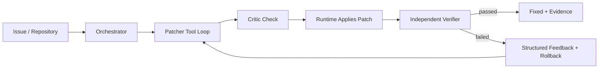
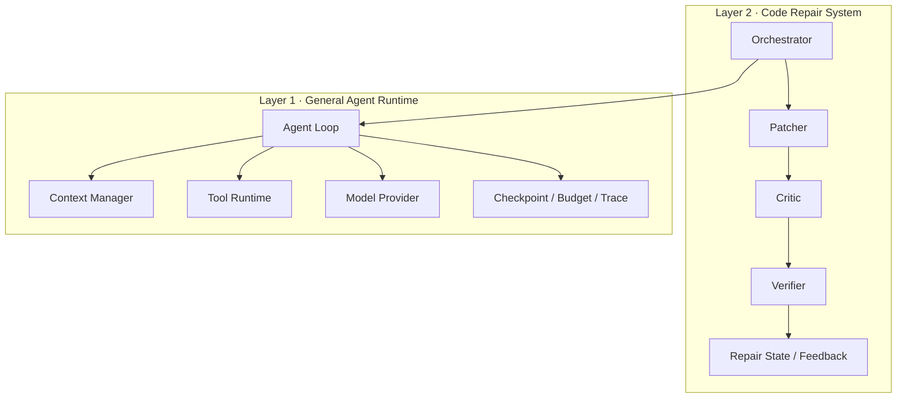

# FixLoop

> 通用 Agent Harness 与代码修复系统：让 Agent 的执行过程可控、可恢复、可验证、可观测。

[](https://www.python.org/downloads/)
[](https://docs.pytest.org/)
[](https://www.docker.com/)
[](https://github.com/changsheng1224/FixLoop)

## 项目背景与目标

复杂 Agent 任务的难点不只是让模型生成一次正确答案，而是如何在多轮推理和工具调用中持续控制状态、成本与风险。随着任务变长，系统容易出现上下文膨胀、重复调用、越权写入、执行空转、任务中断以及“模型认为完成但结果未经验证”等问题；如果运行时能力与具体业务流程耦合，类似机制也很难在其他 Agent 场景中复用。

FixLoop 因此被设计为一套通用 Agent Harness：底层自研 Agent Runtime，统一承载模型调用、Agent Loop、工具执行、Context、Checkpoint 和 Trace；上层以代码缺陷修复作为参考实现，通过 Patcher、Critic、Verifier 与 Orchestrator 构成受控闭环，验证底层机制在真实多步任务中的可复用性。

项目关注的不是让多个 Agent 简单轮流对话，而是建立清晰的执行权、工具权和裁决权边界：模型负责理解问题和提出修改，Runtime 负责安全执行，Verifier 以真实测试结果判断补丁是否成立。

## 整体工作流



Patcher 在受限工具集合内探索代码并提出补丁；Critic 在提交前执行轻量检查；Runtime 确定性应用修改；Verifier 在独立环境运行测试或静态检查。失败结果被转换为结构化反馈后回到 Patcher，直至修复成功、预算耗尽、超时、取消或触发无进展止损。

## 核心能力

| 能力                  | 作用                                                                                                    |
| --------------------- | ------------------------------------------------------------------------------------------------------- |
| 自研 Agent Runtime    | 不依赖 LangChain/LangGraph，实现模型调用、ReAct Loop、Function Calling、流式输出和状态管理              |
| 受控修复编排          | 以 Patcher 主循环、Critic 检查、独立 Verifier 和 Orchestrator 管理职责边界及状态收敛                    |
| Tool Runtime          | 统一 Tool Schema、Registry、Gateway 与 Executor，执行参数、路径、权限、配额、审批和快照治理             |
| Context 与长任务治理  | 按上下文类型分配预算，通过 L0–L5 分级压缩保留任务要求、安全约束、关键代码证据和验证反馈                 |
| 验证与回滚闭环        | 模型只提出修改，由 Runtime 应用补丁；通过 pytest 或 Docker 验证，失败后回滚并生成下一轮结构化反馈       |
| Checkpoint 与执行控制 | 支持步数/时间预算、No-progress、Cancellation、Deadline 与 Checkpoint/Resume，控制空转并安全恢复任务     |
| 评测与可观测          | 以 Canonical Trace 贯穿模型、Context、Tool、Patch 与 Verification，配合 Prometheus、Langfuse 和回归门禁 |
| Provider 韧性与降级   | 提供超时、重试、Circuit Breaker、限流及检索/模型路径降级，避免外部依赖异常拖垮完整任务                  |

## 双层架构



| 层级    | 定位                                                                                                 |
| ------- | ---------------------------------------------------------------------------------------------------- |
| Layer 1 | 通用 Agent 运行内核，对外提供稳定执行循环、工具、上下文、任务控制和可观测能力，不感知代码修复业务    |
| Layer 2 | 代码修复参考实现，负责 Issue 处理、补丁协作、验证反馈、回滚与终态管理，通过 Runtime 接口使用底层能力 |

这种拆分使模型供应商、工具实现和具体任务流程可以独立替换，同时避免将代码修复规则写入通用 Runtime。

## Agent Runtime 与任务治理

一次任务由统一 Agent Loop 驱动，每轮按“构建上下文 → 调用模型 → 解析决策 → 执行工具 → 写回 Observation”推进。Runtime 对模型决策设置明确边界：

- 使用结构化 Tool Schema 与参数校验，模型不能绕过 Tool Gateway 直接执行动作；
- 使用步数、时间、Token 和 Tool Call 预算限制任务成本；
- 通过重复调用检测和 No-progress 规则识别空转；
- CancellationToken 贯穿模型、工具、沙箱与 Orchestrator；
- 每个安全边界写入 Checkpoint，恢复时重新校验 Workspace 状态与剩余预算。

## Tool Runtime 与安全执行

```text
Model Tool Call
  → Schema Validation
  → Workspace / Path Policy
  → Role Permission
  → Quota / Duplicate / Approval Gate
  → Executor
  → Normalized Observation
  → Snapshot Diff / Rollback
```

所有工具调用经过统一入口。文件路径被锚定在 Workspace；敏感路径、路径逃逸和未授权 Shell 被拒绝；修改类工具支持 Diff 预览、审批与前后快照。Docker 验证默认关闭网络，设置 CPU/内存限制、只读 RootFS 与非 Root 用户，并在结束、超时或取消时回收容器。

Docker 用于隔离验证环境和宿主依赖，但不被描述为能够运行任意不受信任输入的完整安全沙箱。

## Context 与长任务治理

Context 按 System、Tools、Knowledge、History、State 等类型分配独立预算。L0–L5 压缩从工具结果截断、消息裁剪逐步升级到结构化折叠与摘要，优先保留用户目标、安全约束、当前 Repair State、关键代码证据和最新验证反馈。

原始 History 保持追加写入，压缩结果仅用于本轮 Context Projection；Checkpoint 保存任务状态、预算、关键工件与 Workspace 指纹，避免恢复时在过期代码状态上继续执行。

## 验证、Trace 与失败归因

补丁是否正确由独立 Verifier 判定，而不是依赖模型自评。验证失败后，系统提取失败测试、错误摘要、上轮 Diff 与构建日志形成结构化反馈；修改先回滚，再进入下一轮修复，防止失败补丁污染后续状态。

Canonical Trace 使用统一 `run_id/trace_id` 串联模型调用、工具执行、Context 压缩、补丁和验证事件，并以 Span 表达阶段关系。Langfuse 用于分析单次轨迹，Prometheus 用于聚合成功率、延迟、Token、工具拒绝和沙箱耗时；评测框架进一步区分模型决策、上下文、工具、补丁、验证环境和 Harness 等失败来源。

## 项目指标

| 项目结果   | 指标表现                                                                             |
| ---------- | ------------------------------------------------------------------------------------ |
| 修复效果   | 正式 60-run 评测中完整编排 `30/30` 修复成功，Single-Agent 基线 `29/30`               |
| Patch 质量 | Patch 精度 `1.22`，高于 Single-Agent 基线的 `0.94`；引入回归率为 `0%`                |
| 工程规模   | 生产代码约 `5.5 万`行，覆盖 Runtime、Repair、Evaluation、Harness 与 Observability    |
| 自动化验证 | 建设约 `2,183` 个 pytest 测试函数，覆盖 Agent Loop、Tool、Context、Repair 与 Sandbox |
| 安全执行   | 正式评测与验证链路中补丁均经确定性应用与独立 Verifier 判定                           |

## 快速开始

### 环境要求

- Python `3.11+`
- 可选：Docker，用于隔离验证
- 可选：DeepSeek API Key，用于真实模型修复

### 安装

```bash
git clone https://github.com/changsheng1224/FixLoop.git
cd FixLoop
pip install -e ".[dev]"
```

运行通用 Agent Runtime：

```bash
python -m agent_runtime "列出当前目录下的 Python 文件"
```

运行代码修复：

```bash
python -m src.cli repair \
  --issue "TypeError in calculator.py:6" \
  --repo demo/calculator \
  --verbose
```

运行无需真实 API 的单 Case 评测：

```bash
python -m src.cli eval --case case_001 --fake --markdown
```

## License

[MIT](https://github.com/changsheng1224/FixLoop)
