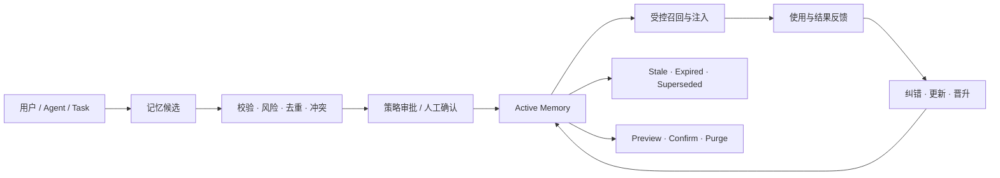
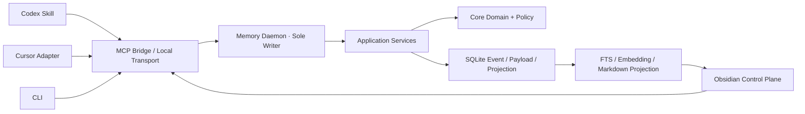

# MemControl

> 面向 Coding Agent 的本地优先、跨客户端、可审计长期记忆控制面。

[](https://www.typescriptlang.org/)
[](https://www.sqlite.org/)
[](https://modelcontextprotocol.io/)
[](https://obsidian.md/)

## 项目背景与目标

Coding Agent 的内建 Memory 通常服务于单一客户端的使用连续性，但当用户同时使用 Codex、Cursor 等工具时，长期偏好、项目决策、约束和经验容易被分散在不同产品中。更重要的是，“能够记住”并不等于“能够可信地管理”：自动写入可能保存猜测或敏感信息，跨项目召回可能造成 Scope 泄漏，冲突记忆可能被静默覆盖，删除操作也可能只移除界面记录而留下正文或索引残留。

MemControl 的目标不是让 Agent 无限制地记住更多，而是让多个 Agent 使用同一份由用户拥有、能够检查、审批、纠错、迁移并验证删除的长期记忆。项目将记忆从“聊天产品的附属功能”提升为独立治理系统，覆盖产生、候选、审批、存储、召回、反馈、更新、晋升、衰减、失效和删除的完整生命周期。

Obsidian 在系统中承担面向用户的薄控制面：用户可以流畅浏览已生效记忆、处理候选、查看冲突和版本关系、检查召回记录并完成删除确认；所有写操作仍由 Memory Daemon 统一执行，界面不会直接修改底层数据库。

## 与内建 Memory 和 RAG 的区别

| 方案                  | 主要目标                             | MemControl 的差异                                                          |
| --------------------- | ------------------------------------ | -------------------------------------------------------------------------- |
| Codex/Cursor 内建记忆 | 优化单个产品内的个性化与会话连续性   | 提供跨客户端统一记忆、用户所有权、完整审计以及一致的写入和删除契约         |
| 普通知识库 RAG        | 从文档集合中检索与当前问题相关的内容 | 关注记忆是否应该写入、属于哪个 Scope、是否冲突、何时失效以及能否被真正删除 |
| 简单 KV/向量记忆      | 保存内容并按 Key 或相似度取回        | 在检索之前增加候选审批、来源追踪、风险分级、版本治理和生命周期状态机       |

检索只是 MemControl 的一个环节。项目的第一价值是治理正确性，其次才是召回质量。

## 记忆生命周期



生命周期由四个闭环组成：

- **写入闭环**：产生 → 候选 → 校验 → 审批 → 激活；
- **使用闭环**：召回 → Context 注入 → 使用追踪 → 结果关联；
- **演化闭环**：冲突 → 纠错/更新 → Supersede → 衰减/失效 → 晋升；
- **治理闭环**：Scope → 权限 → 审计 → 删除验证 → 故障恢复。

## 核心能力

| 能力                 | 作用                                                                                                      |
| -------------------- | --------------------------------------------------------------------------------------------------------- |
| 记忆产生与候选治理   | 接收用户显式记住、Agent 提议、Task Finalize 与受控导入；长期记忆在激活前必须经过策略判断                  |
| Scope 与权限隔离     | 支持 Global、Workspace、Project 等 Scope，使用确定性匹配和角色权限防止跨项目、跨客户端越权                |
| 去重与冲突处理       | 基于内容 Hash 和逻辑身份识别重复与冲突，支持 Reject、Keep Both、Correct 和 Supersede，不采用静默覆盖      |
| 可信存储与版本演化   | 采用 Event、Payload、Projection、FTS/Embedding 分层存储，正文独立加密，所有变更保留 Revision 与 Lineage   |
| 可解释召回与注入     | 经 Scope、状态和时间硬过滤后融合 FTS/Embedding，并按 Salience、来源质量和 Token Budget 输出召回解释       |
| 使用反馈与记忆晋升   | 区分 Recalled、Used、OutcomeLinked 与 Corrected，只有具备证据的 Episodic Memory 才能晋升为 Procedural     |
| 衰减、失效与过期     | 按记忆类型执行 Salience 衰减；权威来源变化标记 Stale，超过 ValidUntil 转为 Expired，默认不再召回          |
| 可验证删除与恢复治理 | 删除采用 Preview、Revision 和 Confirmation Token，清理正文、索引、投影及数据密钥，并通过 Tombstone 防复活 |

## 系统架构



| 模块             | 定位                                                                      |
| ---------------- | ------------------------------------------------------------------------- |
| `core`           | 定义 Memory Envelope、Scope、角色、生命周期状态机、领域事件与诊断契约     |
| `application`    | 编排候选、审批、召回、冲突、反馈、晋升、删除、Doctor 和 Bundle 等治理用例 |
| `storage-sqlite` | 提供 Event/Payload/Projection、FTS、迁移、加密、并发控制和受管删除        |
| `daemon-node`    | 本地唯一写入权威，负责单写者锁、鉴权、本地传输和故障恢复                  |
| Client Adapters  | 通过 Codex Skill、Cursor、MCP、CLI 和 Obsidian 接入同一治理契约           |

架构的核心约束是所有客户端只能提出请求，不能直接读写 SQLite。Memory Daemon 串行提交事件与 Projection，使用 Request Idempotency、Expected Revision 和事务保证并发一致性；MCP Bridge 保持无状态，客户端异常不会产生旁路写入。

## 写入与冲突治理

记忆写入不是简单的 `save(text)`，而是一条固定治理流水线：

```text
Schema Validation
  → Secret / PII Scan
  → Scope & Permission Check
  → Provenance & Evidence Check
  → Duplicate Detection
  → Conflict Detection
  → Risk Classification
  → Approval Policy
  → Transactional Activation
```

稳定偏好、长期目标、已确认决策、长期约束和已验证经验适合进入长期记忆；临时报错、普通工具结果、未经验证的猜测、完整聊天轨迹、密钥和当前任务 Working State 会被拒绝或保持为未激活候选。

对于可变语义，系统使用 `scope + type + subject + key` 建立逻辑身份。新旧结论冲突时进入 Conflict Workbench，由用户查看 Diff、来源与版本 Lineage 后选择保留、修正、拒绝或 Supersede，避免 Last-write-wins 掩盖真实冲突。

## 召回、反馈与晋升

召回先执行 Scope、状态、有效期等硬过滤，再进行 FTS 与可选 Embedding 检索，融合相关性、Salience 和来源质量，并在 Token Budget 内构建 Context。返回结果包含命中的 Scope、逻辑 Key、有效版本、来源与选择原因；记忆内容被包装为 Reference-only / Untrusted Context，不能覆盖系统指令。

系统区分“被召回”和“被实际使用”。单纯召回次数或一次任务成功不会自动提升 Confidence；只有显式确认、权威验证、独立证据、纠错或反例才能影响置信度。经过验证的 Episodic Memory 可以提出 Procedural 候选，但晋升与导出为 Skill、Rule 或 AGENTS.md 均需要独立审批。

## 用户可见的记忆管理

Obsidian 插件提供面向用户的记忆库界面，而不是要求用户直接维护 Markdown 或数据库：

- 浏览与筛选当前有效记忆，查看 Scope、类型、来源和版本；
- 在 Candidate Inbox 中审批、拒绝或批量清理候选；
- 通过 Conflict Workbench 对比差异、查看 Lineage 并填写处理原因；
- 查看单条记忆的审计时间线和近期 Recall/Used 记录；
- 发起纠错、更新、Supersede、晋升和重新校验；
- 通过删除 Preview 查看影响面，再以确认令牌提交删除并清除投影。

Markdown Projection 只负责提供舒适、可搜索的阅读视图，Daemon 才是状态权威。离线时允许浏览只读缓存和保存本地草稿，但审批、修改和删除会明确拒绝；重新连接后必须重新校验。

## 存储、删除与审计

MemControl 将事件元数据与记忆正文分离：Event Store 保留生命周期事件和不可逆内容 Hash；Payload Store 保存正文、证据和 Diff，并使用每条记忆独立的数据密钥；Projection 与 FTS/Embedding 是可重建派生数据。

删除采用两阶段协议。Preview 返回 Payload、索引、投影、缓存和密钥等影响面，并签发绑定 Memory ID 与 Revision 的 Confirmation Token；Commit 在同一事务内清理受管正文、FTS、Projection 和数据密钥，随后执行残留检查。Event Store 仅保留不含正文的 Tombstone 元数据，备份恢复时必须重放 Tombstone，防止已删除记忆重新出现。

## 项目指标

| 项目结果       | 指标表现                                                              |
| -------------- | --------------------------------------------------------------------- |
| 写入质量       | Write Precision `100%`，Write Recall `100%`                           |
| 冲突治理       | Conflict Accuracy `100%`，人工纠错与覆盖链路完整生效                  |
| 作用域与来源   | Scope Leakage `0`，Provenance Coverage `100%`                         |
| 敏感信息治理   | Secret Refusal Rate `100%`，Plaintext Secret Persistence `0`          |
| 生命周期正确性 | Illegal Transition Success `0`，全生命周期连续流程覆盖 `22` 个步骤    |
| 删除完整性     | Managed Deletion Residual `0`，删除后正文不可召回且投影同步清除       |
| 使用验证       | 覆盖 `15` 个 Dogfood Case 与 `12` 个 Narrative Case，关键流程全部通过 |

## 快速开始

### 环境要求

- Node.js `22.5+`
- npm Workspaces
- 可选：Obsidian，用于图形化记忆管理

### 安装与验证

```bash
git clone https://github.com/changsheng1224/MemControl.git
cd MemControl
npm install
npm run typecheck
npm run build
npm run oracle
npm run demo
```

常用入口：

```bash
npm run contrast       # 对比朴素 KV / RAG 与治理型 Memory
npm run narrative      # 运行脱敏个人使用场景
npm run vault-loop     # 验证真实 Vault 浏览、治理与删除闭环
npm run scale          # 运行 CI-safe 规模 Smoke
```
